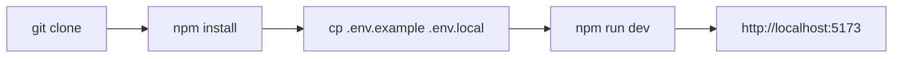
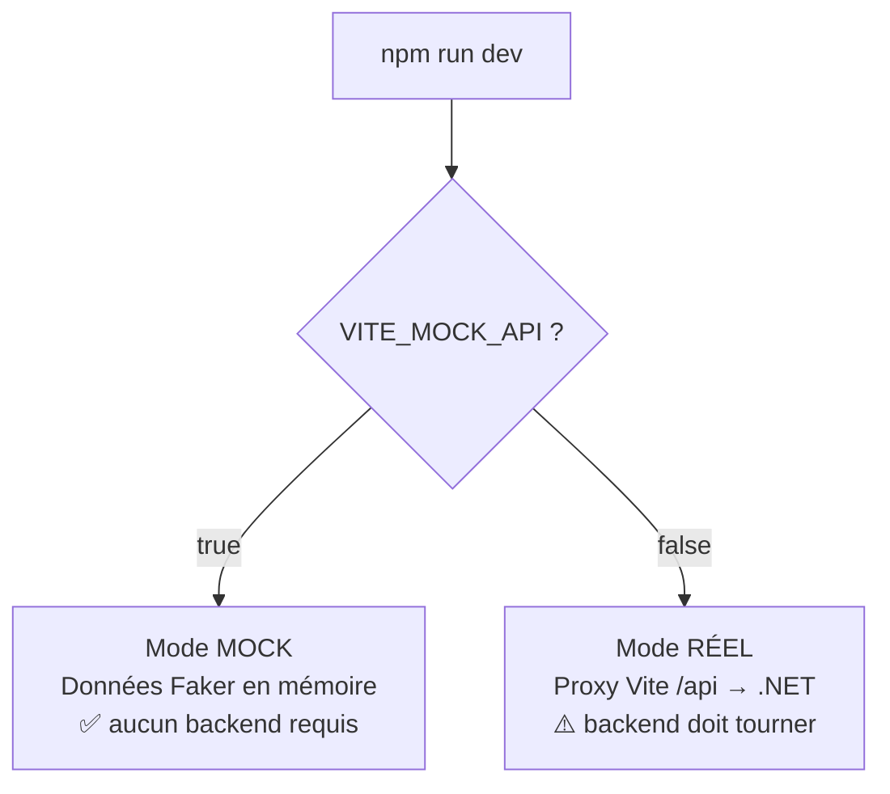
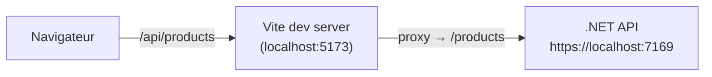

# Installation & démarrage

Guide pour installer, configurer et lancer Cyna-Web en local — avec ou sans le
backend .NET. Pour les conventions de code et la structure détaillée, voir
[01 Structure et conventions](./01%20Structure%20et%20conventions.md). Pour le
déploiement (Docker, CI/CD, nginx), voir
[11 CI/CD et déploiement](./11%20cicd%20et%20deploiement.md).

---

## 1. Prérequis

| Outil | Version | Vérifier |
|---|---|---|
| **Node.js** | ≥ 20.19 (ou ≥ 22.12) — LTS recommandé | `node -v` |
| **npm** | fourni avec Node | `npm -v` |
| **Git** | récent | `git --version` |
| Backend .NET | *optionnel* (le mode mock fonctionne sans) | — |

> Le CI tourne sur `node:22-slim`. En cas de modification des dépendances depuis
> Windows, régénérer le lockfile dans un conteneur Linux (voir
> [01 Structure et conventions](./01%20Structure%20et%20conventions.md#compatibilité-ci--windows)).

---

## 2. Installation en 3 étapes

```bash
# 1. Cloner le dépôt
git clone <url-du-depot> Cyna-Web
cd Cyna-Web

# 2. Installer les dépendances
npm install

# 3. Créer le fichier d'environnement local
cp .env.example .env.local      # PowerShell : Copy-Item .env.example .env.local
```

Puis lancer le serveur de développement :

```bash
npm run dev      # http://localhost:5173
```



---

## 3. Variables d'environnement

Toutes les variables sont préfixées `VITE_` (obligatoire pour être exposées au
client). Elles vivent dans `.env.local` (non versionné, copié depuis
`.env.example`).

| Variable | Défaut | Rôle |
|---|---|---|
| `VITE_API_URL` | `/api` | Base des appels API. Garder `/api` en dev (proxy Vite) |
| `VITE_MOCK_API` | `false` | `true` → faux backend interne (Faker), aucun serveur requis |
| `VITE_MOCK_DELAY` | `400` | Latence simulée (ms) des réponses mock |
| `VITE_OVERRIDE_ROLE` | `true` (exemple) | **Dev only** : vue admin/user dérivée de l'URL ([détail](./04%20authentification.md)) |

> ⚠️ Toute variable `VITE_*` est **embarquée dans le bundle** → visible
> publiquement. N'y mettez **jamais** de secret.

---

## 4. Deux modes de fonctionnement



### Mode A — Mock (recommandé pour démarrer)

Aucun backend nécessaire ; les appels sont servis par des données générées.
Détails : [06 Mock et tests](./06%20mock%20et%20tests.md).

```bash
# .env.local
VITE_MOCK_API=true
VITE_OVERRIDE_ROLE=true     # optionnel : accès admin sans login
```

Au démarrage, la console du navigateur liste les routes mockées :
```
[Mock] Registered routes
  GET     /products
  POST    /auth/login
  ...
```

### Mode B — Backend .NET réel

Le proxy Vite (`vite.config.ts`) redirige `/api/*` vers `https://localhost:7169`
(en retirant le préfixe `/api`) → évite les soucis de CORS et de cookies.

```bash
# .env.local
VITE_MOCK_API=false
VITE_API_URL=/api
```



Prérequis : le backend .NET tourne sur `https://localhost:7169` (sinon adapter la
cible dans `vite.config.ts`). Voir [03 Couche réseau](./03%20couche%20reseau.md).

---

## 5. Scripts npm

| Commande | Effet |
|---|---|
| `npm run dev` | Serveur de développement (HMR) sur le port 5173 |
| `npm run build` | Build de production dans `dist/` |
| `npm run preview` | Sert le `dist/` localement (test du build) |
| `npm run lint` | Analyse ESLint du code |

---

## 6. Build & déploiement

```bash
npm run build      # génère dist/
npm run preview    # prévisualise sur http://localhost:4173
```

En production, l'app est servie par **nginx** dans une image Docker multi-stage,
avec un **fallback SPA** (toute route inconnue → `index.html`). L'URL de l'API
(`VITE_API_URL`) est *baked-in* au build via un `ARG` Docker. Tout est détaillé
dans [11 CI/CD et déploiement](./11%20cicd%20et%20deploiement.md).

---

## 7. Dépannage (FAQ)

| Symptôme | Cause probable | Solution |
|---|---|---|
| Erreur de certificat SSL vers `localhost:7169` | Certificat .NET auto-signé | Déjà géré (`secure: false`). Sinon `dotnet dev-certs https --trust` |
| Appels API en 404 | Mauvaise base d'URL | Garder `VITE_API_URL=/api` en dev |
| Aucune donnée, backend éteint | Mode réel actif | Passer `VITE_MOCK_API=true` |
| Un appel mock n'est pas intercepté | Handler non enregistré / chemin différent | Voir [Lier l'API et le mock](./api/Lier%20api%20et%20mock.md#déboguer-le-mock) |
| Modif `.env.local` sans effet | Vite lit l'env au démarrage | Redémarrer `npm run dev` |
| Port 5173 occupé | Autre process | `npm run dev -- --port 3000` |
| Variables d'env `undefined` | Préfixe manquant | Toute variable client doit commencer par `VITE_` |

---

## 8. Et ensuite ?

- [01 Structure et conventions](./01%20Structure%20et%20conventions.md)
- [02 Architecture](./02%20architecture.md)
- [05 Routing et gardes](./05%20routing%20et%20gardes.md)
- [Référence des endpoints API](./api/endpoints.md)
