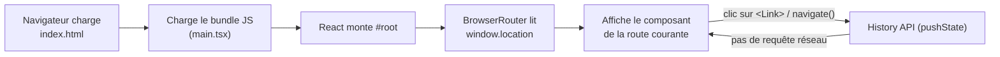

# Routing et gardes de routes

## Le principe SPA (rendu côté client)

Cyna-Web est une **Single Page Application** : le serveur ne sert qu'**un seul**
fichier HTML (`index.html` → `<div id="root">`). Toute la navigation est ensuite
gérée **côté client** par React Router, sans rechargement complet du navigateur.



Conséquences pratiques :

- **Navigation interne** : toujours via `<Link to>` ou `useNavigate()` — jamais
  `<a href>` ni `window.location` (qui forcent un rechargement et perdent l'état
  React). Exception assumée : `logout()` fait `window.location.href = "/"` pour
  repartir d'un état propre.
- **Deep-linking / rechargement (F5)** ⚠️ : ouvrir directement
  `https://cyna.app/products/abc-123` envoie cette URL au **serveur**, qui ne
  connaît que `index.html`. Sans configuration, il renverrait un 404. La solution
  (**fallback SPA** : toute route inconnue → `index.html`) est assurée par nginx
  en production — voir
  [11 CI/CD et déploiement](./11%20cicd%20et%20deploiement.md#nginxconf--spa-routing).
  En dev, le serveur Vite gère ce fallback automatiquement.
- **404 applicatif** : une fois `index.html` chargé, c'est React Router qui décide
  si l'URL correspond à une route connue ou à la page `NotFound` (`path="*"`).
- **Code-splitting** : aujourd'hui les pages sont importées statiquement, mais le
  `<Suspense>` est déjà en place pour passer au lazy-loading (voir
  [12 Scalabilité](./12%20scalabilite%20et%20performance.md#1-taille-du-bundle--code-splitting)).

---

## Vue d'ensemble

```
App.jsx
    └─ BrowserRouter
           └─ Suspense (fallback: <Loading />)
                  └─ Routes
                         │
                         ├─ Routes libres (aucune garde)
                         │
                         ├─ <UserRoute>      (Outlet)
                         │
                         ├─ <AdminRoute>     (Outlet)
                         │
                         ├─ <AuthRoute>      (Outlet)
                         │
                         └─ <UserAuthRoute>  (Outlet)
```

Toutes les gardes sont définies dans `src/wrapper.jsx` et consomment `useAuth()`.

---

## Table complète des routes

### Routes libres (non gardées)

| Chemin | Composant | Description |
|--------|-----------|-------------|
| `/login` | `Login` | Connexion utilisateur |
| `/register` | `Register` | Inscription |
| `/admin/login` | `AdminLogin` | Connexion admin (2 phases TOTP) |
| `/forgot-password` | `ForgotPassword` | Mot de passe oublié |
| `/reset-password` | `ResetPassword` | Réinitialisation par OTP |
| `/confirm-email` | `ConfirmEmail` | Confirmation email par OTP |
| `/cgu` | `CGU` | Conditions générales |
| `/mentions-legales` | `MentionsLegales` | Mentions légales |
| `/privacy` | `Privacy` | Politique de confidentialité |
| `/downloads` | `Downloads` | Téléchargements |
| `/contact` | `Contact` | Contact / devis |
| `/loading` | `Loading` | Écran de chargement |
| `/unauthorized` | `Unauthorized` | Accès non autorisé (401) |
| `*` | `NotFound` | Page 404 |

### UserRoute — utilisateurs non-admin

| Chemin | Composant | Description |
|--------|-----------|-------------|
| `/` | `Home` | Page d'accueil |
| `/search` | `Search` | Recherche globale |
| `/catalog/category/:slug` | `Catalog` | Catalogue par catégorie |
| `/products/:id` | `Product` | Fiche produit + tarification |
| `/cart` | `Cart` | Panier |
| `/checkout` | `Checkout` | Tunnel de paiement |
| `/order-confirmation` | `OrderConfirmation` | Confirmation commande |

### AdminRoute — backoffice

| Chemin | Composant | Description |
|--------|-----------|-------------|
| `/admin/dashboard` | `Loading` ⚠️ | Tableau de bord (placeholder) |
| `/admin/categories` | `AdminCategories` | CRUD catégories |
| `/admin/products` | `AdminProducts` | Listing produits |
| `/admin/products/new` | `AdminProductForm` | Création produit |
| `/admin/products/:id/edit` | `AdminProductForm` | Édition produit |
| `/admin/users` | `AdminUsers` | Gestion utilisateurs |

> ⚠️ `/admin/dashboard` pointe sur `<Loading />` — le composant Dashboard n'est pas encore implémenté.

### AuthRoute — utilisateurs connectés

| Chemin | Composant | Description |
|--------|-----------|-------------|
| `/account/profile` | `Profile` | Profil + abonnements |
| `/account/security/2fa` | `Security2FA` | Configuration TOTP |

### UserAuthRoute — utilisateurs authentifiés non-admin

| Chemin | Composant | Description |
|--------|-----------|-------------|
| `/account/orders` | `OrderHistory` | Historique des commandes |

---

## Gardes de route

### `UserRoute`

Redirige les admins vers le backoffice. Laisse passer utilisateurs et invités.

```jsx
export function UserRoute() {
  const { loading, isAdminView } = useAuth()
  if (loading)      return <Loading />
  if (isAdminView)  return <Navigate to="/admin/dashboard" replace />
  return <Outlet />
}
```

| État | Comportement |
|------|-------------|
| `loading=true` | Affiche `<Loading />` |
| `isAdminView=true` | Redirige vers `/admin/dashboard` |
| Sinon | Affiche la route (`<Outlet />`) |

### `AdminRoute`

Réservé aux administrateurs uniquement.

```jsx
export function AdminRoute() {
  const { isAdminView, loading } = useAuth()
  if (loading)       return <Loading />
  if (!isAdminView)  return <Navigate to="/" replace />
  return <Outlet />
}
```

| État | Comportement |
|------|-------------|
| `loading=true` | Affiche `<Loading />` |
| `isAdminView=false` | Redirige vers `/` |
| Sinon | Affiche la route (`<Outlet />`) |

### `AuthRoute`

Réservé aux utilisateurs connectés (admin ou non).

```jsx
export function AuthRoute() {
  const { loading, user } = useAuth()
  if (loading) return <Loading />
  if (!user)   return <Navigate to="/login" replace />
  return <Outlet />
}
```

| État | Comportement |
|------|-------------|
| `loading=true` | Affiche `<Loading />` |
| `user=null` | Redirige vers `/login` |
| Sinon | Affiche la route |

### `UserAuthRoute`

Réservé aux utilisateurs authentifiés non-admin.

```jsx
export function UserAuthRoute() {
  const { loading, isAuthenticated, isAdminView } = useAuth()
  if (loading)          return <Loading />
  if (!isAuthenticated) return <Navigate to="/login" replace />
  if (isAdminView)      return <Navigate to="/admin/dashboard" replace />
  return <Outlet />
}
```

| État | Comportement |
|------|-------------|
| `loading=true` | Affiche `<Loading />` |
| Non authentifié | Redirige vers `/login` |
| Admin sur une route user | Redirige vers `/admin/dashboard` |
| Sinon | Affiche la route |

---

## Diagramme de décision

```
URL reçue
    │
    ├─ Route libre ? ──────────────────────────────► Rendu direct
    │   (/login /register /admin/login /cgu …)
    │
    ├─ Sous <UserRoute> ?
    │       │
    │       ├─ loading → <Loading />
    │       ├─ isAdminView → redirect /admin/dashboard
    │       └─ sinon → Outlet ✅
    │
    ├─ Sous <AdminRoute> ?
    │       │
    │       ├─ loading → <Loading />
    │       ├─ !isAdminView → redirect /
    │       └─ sinon → Outlet ✅
    │
    ├─ Sous <AuthRoute> ?
    │       │
    │       ├─ loading → <Loading />
    │       ├─ !user → redirect /login
    │       └─ sinon → Outlet ✅
    │
    └─ Sous <UserAuthRoute> ?
            │
            ├─ loading → <Loading />
            ├─ !isAuthenticated → redirect /login
            ├─ isAdminView → redirect /admin/dashboard
            └─ sinon → Outlet ✅
```

---

## `isAdminView` — logique complète

```
useAuth()
    │
    ├─ VITE_OVERRIDE_ROLE=true
    │       isAdminView = pathname.startsWith("/admin")
    │       [valeur déterminée par l'URL — utile en dev sans login]
    │
    └─ VITE_OVERRIDE_ROLE=false (ou absent)
            isAdminView = context.isAdmin
            isAdmin = ["Administrateur", "Super Administrateur"].includes(user?.role ?? "")
            [valeur déterminée par le rôle JWT réel]
```

---

## Flux de navigation complet

### Achat (Product → Cart → Checkout)

```
/catalog/category/:slug ──► /products/:id
                                 │ Ajouter au panier
                                 ▼
                            /cart
                                 │ Passer à la caisse
                                 ▼
                            /checkout
                                 │ Paiement validé
                                 ▼
                         /order-confirmation
```

### Authentification

```
/login ──────────────────────────────────────► /
/register ──────────────────────────────────► /confirm-email?email=…
/forgot-password ───────────────────────────► /reset-password?email=…
/reset-password ──── succès ────────────────► /login
/confirm-email ───── succès ────────────────► /
/admin/login ─── phase 1 OK, TOTP attendu ──► /admin/login (phase 2)
/admin/login ─── bootstrap 2FA ─────────────► /account/security/2fa
/admin/login ─── succès complet ────────────► /admin (→ /admin/dashboard)
```

### Redirections automatiques selon le rôle

```
Admin accède à / ou /catalog → UserRoute → redirect /admin/dashboard
User accède à /admin/* → AdminRoute → redirect /
User non connecté accède à /account/orders → UserAuthRoute → redirect /login
```