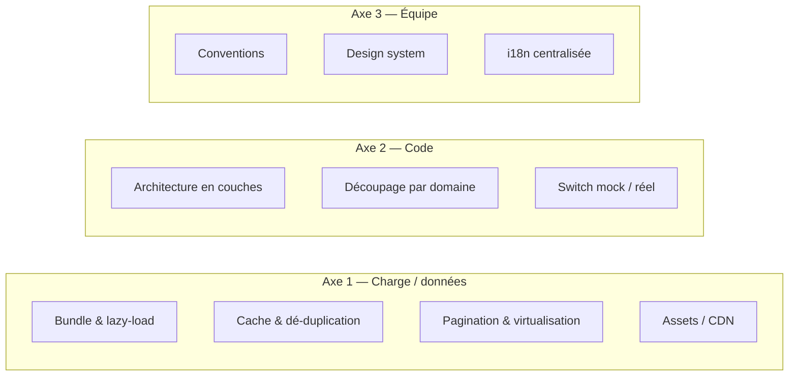
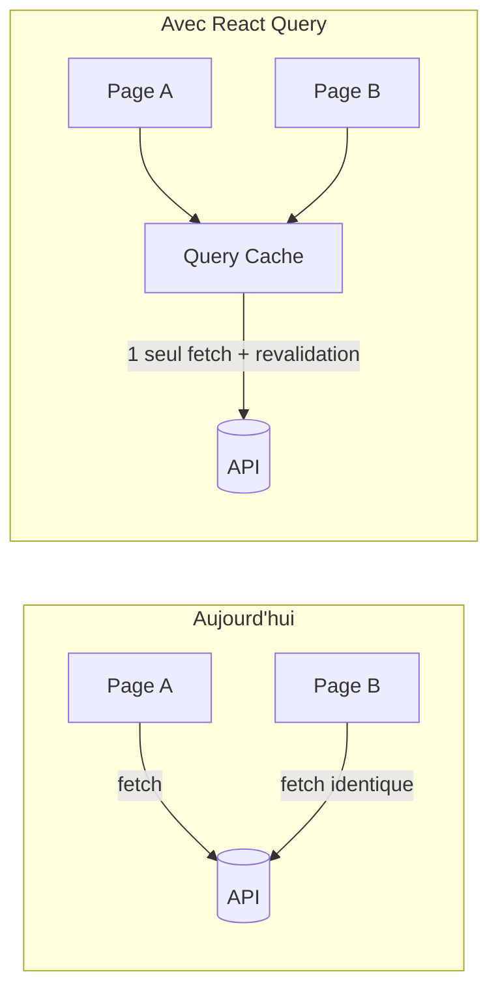

# Scalabilité et performance

La « scalabilité » d'un frontend ne se mesure pas en requêtes/seconde (c'est le
rôle du backend), mais en capacité à **grossir sans se dégrader** sur trois axes :

1. **Performance** quand le volume de données et d'utilisateurs augmente.
2. **Code** quand le nombre de fonctionnalités augmente.
3. **Équipe** quand le nombre de contributeurs augmente.

Ce document liste les choix déjà en place et les leviers à activer quand
l'application grandit, avec des **seuils concrets**. Il complète
[02 Architecture](./02%20architecture.md) (les couches) et
[11 CI/CD et déploiement](./11%20cicd%20et%20deploiement.md) (l'infra).



---

## Axe 1 — Performance & charge

### 1. Taille du bundle & code-splitting

**État actuel :** toutes les pages sont importées statiquement dans `App.jsx`.
Le bundle initial contient donc *tout* le code, y compris le back-office admin
qui ne concerne quasiment aucun visiteur.

**Levier :** découper les routes avec `React.lazy` + le `<Suspense>` déjà présent
(voir [05 Routing et gardes](./05%20routing%20et%20gardes.md)).

```jsx
const AdminDashboard = lazy(() => import("./pages/admin/dashboard.jsx"))
```

| Seuil / signal | Action recommandée |
|---|---|
| Bundle initial > ~300 Ko gzip | Lazy-loader `/admin/**` (public ≠ admin) |
| Une page tire une grosse lib (recharts, stripe) | Lazy-loader cette page précise |
| Plusieurs « gros » écrans | Découper par segment de route + `manualChunks` Vite |

> Le **dashboard admin** tire `recharts` (graphiques) — c'est le premier candidat
> au lazy-load. Mesurer avant d'optimiser : `npm run build` affiche la taille des
> chunks ; `npx vite-bundle-visualizer` donne la répartition.

### 2. Cache et dé-duplication des appels

**État actuel :** chaque page refait ses `fetch` au montage (`useEffect`) — choix
assumé et documenté dans [02 Architecture](./02%20architecture.md#décisions-darchitecture-notables).
Deux composants affichant les mêmes données les rechargent indépendamment.

**Levier :** introduire une lib de **cache de données serveur** (TanStack Query /
SWR) qui dé-duplique, met en cache et revalide automatiquement.



| Seuil / signal | Action recommandée |
|---|---|
| Mêmes données chargées sur plusieurs pages | Introduire React Query |
| Besoin de cache, retry, pagination infinie | React Query (clé par ressource) |
| Données temps réel | WebSocket / SSE + invalidation de cache |

> La couche `api/*.js` actuelle ([03 Couche réseau](./03%20couche%20reseau.md))
> est **compatible** : React Query l'appellerait comme `queryFn`, sans réécrire
> les fonctions métier.

### 3. Listes longues : pagination & virtualisation

- La **pagination** est déjà en place (ex. admin produits, recherche, catalogue —
  `pageSize`, `components/ui/pagination`).
- Pour des listes de plusieurs centaines de lignes rendues d'un coup, ajouter de
  la **virtualisation** (`@tanstack/react-virtual`) : seules les lignes visibles
  sont montées dans le DOM.

| Seuil / signal | Action recommandée |
|---|---|
| Liste > ~50 items | Pagination (déjà disponible) |
| Liste > ~500 lignes affichées simultanément | Virtualisation |

### 4. Assets, images et CDN

- Vite **hash** les assets (`app.[hash].js`) → cache navigateur immuable et
  invalidation automatique à chaque build.
- En production, le `dist/` est servi par **nginx** (image Docker), idéalement
  derrière un **CDN**. Voir [11 CI/CD et déploiement](./11%20cicd%20et%20deploiement.md).
- Images produit : privilégier WebP/AVIF et `loading="lazy"`.

### 5. Recherche : debounce

La recherche utilise déjà `useDebounce` (`hooks/useDebounce.js`) pour ne pas
déclencher un appel à chaque frappe — réduit la charge réseau et backend.

---

## Axe 2 — Scalabilité du code

### Architecture en couches stricte

Le découplage **présentation → logique → accès données → backend**
([02 Architecture](./02%20architecture.md)) permet de modifier une couche sans
casser les autres. Exemple concret : le panier peut passer de `localStorage` à
une vraie API en ne touchant **que** `src/api/cart.js`.

### Découpage par domaine

Chaque domaine métier est isolé et se décline dans les mêmes couches :

```
api/products.js  ↔  mocks/handlers/products.js  ↔  components/product/  ↔  pages/product.jsx
api/cart.js      ↔  (localStorage)              ↔  components/cart/     ↔  pages/cart.jsx
```

Ajouter un domaine = ajouter une « tranche » verticale, sans toucher aux autres.
Voir [03 Couche réseau](./03%20couche%20reseau.md#ajouter-une-nouvelle-ressource--procédure-complète).

### Switch mock / réel

La couche mock (`VITE_MOCK_API`) permet de développer le frontend **en parallèle**
du backend, sans le bloquer. Plusieurs développeurs avancent indépendamment.

---

## Axe 3 — Scalabilité de l'équipe

| Levier | En place ? | Détail |
|---|---|---|
| **Conventions de structure** | ✅ | [01 Structure et conventions](./01%20Structure%20et%20conventions.md) |
| **Design system** | ✅ | `components/ui/` (shadcn) — voir [08 Composants UI et thème](./08%20composants%20ui%20et%20theme.md) |
| **i18n centralisée** | ✅ | Textes hors du code ([07 i18n](./07%20i18n.md)) |
| **Lint + SonarCloud** | ✅ | `npm run lint` + analyse SonarCloud en CI |
| **Typage** | ⚠️ partiel | UI en `.tsx`, métier en `.js` + JSDoc → cible : migration progressive `.ts` |
| **Tests automatisés** | ❌ | À ajouter (Vitest + Testing Library) ; `lib/pricing-utils.js` est le candidat idéal (pur) |

---

## Tableau de synthèse — quand activer quoi

| Symptôme observé | Levier | Effort |
|---|---|---|
| Premier chargement lent | Code-splitting `/admin` | Faible |
| Données rechargées partout | React Query / SWR | Moyen |
| Tableaux qui rament | Virtualisation | Moyen |
| Régressions fréquentes | Tests sur `lib/` + composants critiques | Moyen |
| Conflits de merge fréquents | Renforcer le découpage par domaine | Faible |
| Bugs de typage | Migration progressive vers TypeScript | Élevé |

> **Principe directeur : mesurer puis agir.** N'introduire React Query, la
> virtualisation ou un store global que lorsqu'un besoin réel est constaté — pas
> par anticipation. L'architecture actuelle est conçue pour accueillir ces
> évolutions **sans réécriture**.
