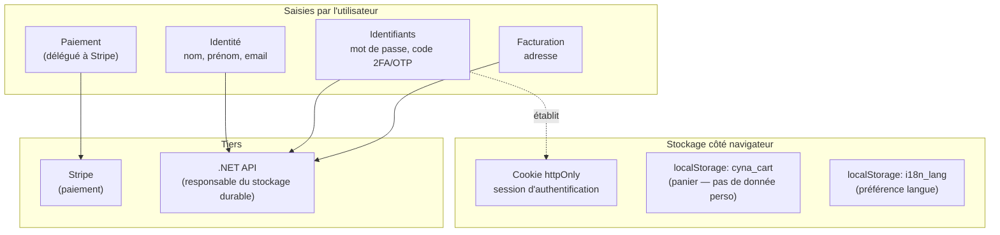
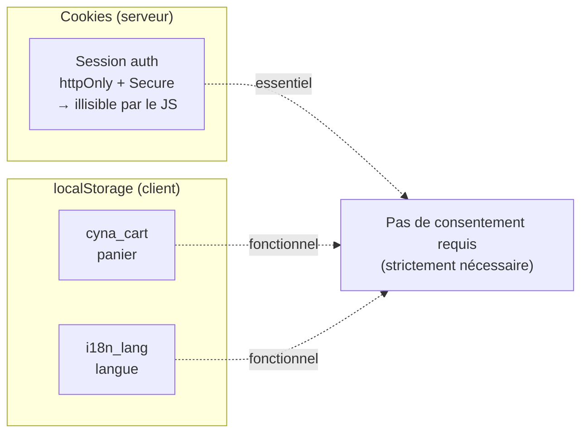
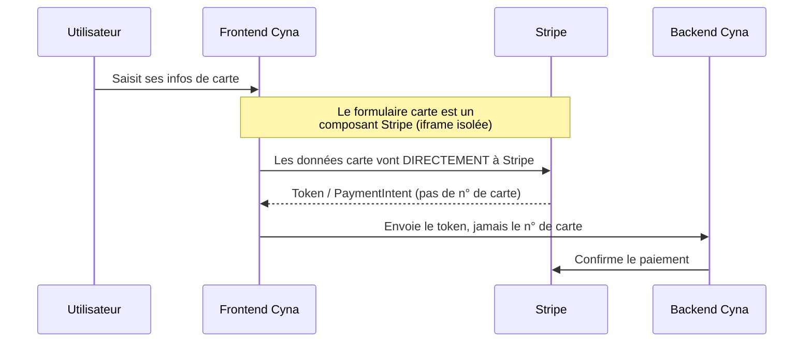
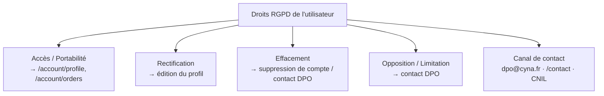

# RGPD & données personnelles (côté frontend)

Le RGPD (Règlement Général sur la Protection des Données) encadre le traitement
des données personnelles. La **responsabilité de traitement** incombe au backend
et à l'entreprise, mais le **frontend** a un rôle concret : il est le point de
collecte, de stockage local et d'affichage des données personnelles.

Ce document décrit ce que le frontend Cyna-Web manipule, où, et comment il
respecte ses obligations. Il complète [04 Authentification](./04%20authentification.md)
(cookies de session) et [07 i18n](./07%20i18n.md) (textes légaux traduits).

> ℹ️ Ce document concerne l'**implémentation technique**. Le contenu juridique
> destiné aux utilisateurs vit dans la page `/privacy`
> (`src/pages/privacy.jsx` + `public/locales/*/privacy.json`).

---

## 1. Inventaire des données personnelles manipulées

| Donnée | Où elle transite | Où elle est stockée durablement |
|---|---|---|
| Nom, prénom, email | Formulaires → API | Backend (jamais en `localStorage`) |
| Mot de passe | Formulaire → API (HTTPS) | Backend (haché) — **jamais** côté client |
| Code 2FA / OTP | Formulaire → API | Non stocké côté client |
| Adresse de facturation | Checkout → API | Backend |
| Données carte bancaire | **Directement Stripe** | **Jamais** côté Cyna (ni front, ni back) |

> **Principe de minimisation appliqué :** le frontend ne **persiste aucune
> donnée personnelle** dans le navigateur. Le panier (`cyna_cart`) ne contient
> que des références produit/quantité/prix, pas d'identité.

---

## 2. Cookies & stockage local

| Stockage | Clé | Type | Contenu | Consentement requis ? |
|---|---|---|---|---|
| Cookie httpOnly | (session) | Strictement nécessaire | Jeton de session | Non |
| localStorage | `cyna_cart` | Fonctionnel | Panier (sans donnée perso) | Non |
| localStorage | `i18n_lang` | Fonctionnel / préférence | Code langue | Non |

### Pourquoi le cookie httpOnly est un bon choix RGPD/sécurité

- **`httpOnly`** : inaccessible au JavaScript → protège contre le vol de session
  par XSS. C'est aussi la raison pour laquelle l'auth **n'est pas** en
  `localStorage` (qui serait lisible par tout script). Voir
  [04 Authentification](./04%20authentification.md).
- **`Secure`** : transmis uniquement en HTTPS.

### ⚠️ Avant d'ajouter un cookie/traceur non essentiel

Actuellement, **aucun cookie analytique ou publicitaire** n'est posé → pas de
bandeau de consentement nécessaire. **Dès qu'un outil de mesure d'audience
(Google Analytics, Matomo non anonymisé, pixel marketing…) est ajouté**, il faut :

1. Un **bandeau de consentement** (CNIL) avec refus aussi simple que l'acceptation.
2. Ne charger le script de tracking **qu'après** consentement explicite.
3. Documenter le traceur dans `/privacy`.

---

## 3. Flux vers les tiers (sous-traitants)

| Sous-traitant | Donnée transmise | Rôle | Localisation |
|---|---|---|---|
| **Stripe** | Données carte (en direct, jamais via Cyna) | Paiement (PCI-DSS) | Voir `/privacy` |
| **Hébergeur** (OVH) | Données transitant par l'infra | Hébergement | UE |

> Les composants `@stripe/react-stripe-js` isolent la saisie carte dans une
> **iframe Stripe** : le numéro de carte ne touche **jamais** le code Cyna →
> réduit drastiquement le périmètre PCI-DSS et RGPD. Voir
> [paiement/stripe-checkout](./paiement/stripe-checkout.md).

---

## 4. Droits des personnes — implémentation frontend

La page `/privacy` (`src/pages/privacy.jsx`) expose les droits et les moyens de
les exercer. Le frontend doit fournir des **parcours** pour :

| Droit | Où l'exercer dans l'app | État |
|---|---|---|
| Accès aux données | `/account/profile`, `/account/orders` | ✅ |
| Rectification | Édition du profil | ✅ |
| Effacement | Contact DPO / suppression de compte | ⚠️ à compléter |
| Portabilité | Export des données | ⚠️ à compléter (export JSON/CSV) |
| Opposition / Limitation | `dpo@cyna.fr`, `/contact` | ✅ (canal) |
| Réclamation | Lien CNIL dans `/privacy` | ✅ |

---

## 5. Sécurité des données en transit & en affichage

- **HTTPS partout** : le proxy Vite cible `https://`, le cookie est `Secure`.
- **Pas de donnée sensible dans l'URL** ni dans les logs console en production.
- **Cookie `httpOnly`** contre le vol de session par XSS.
- **i18next `escapeValue: false`** : React échappe déjà le HTML par défaut →
  pas d'injection via les traductions tant qu'on n'utilise pas
  `dangerouslySetInnerHTML`.
- **Masquage** : n'afficher que les 4 derniers chiffres d'un moyen de paiement
  (`paymentLast4`), jamais le numéro complet.

---

## 6. Checklist RGPD pour toute nouvelle fonctionnalité

Avant de merger une feature qui touche à des données personnelles :

- [ ] La donnée collectée est-elle **strictement nécessaire** (minimisation) ?
- [ ] Est-elle envoyée au backend en **HTTPS** et **pas** persistée en clair côté client ?
- [ ] Si un **cookie/traceur non essentiel** est ajouté → bandeau de consentement en place ?
- [ ] La page `/privacy` est-elle **mise à jour** (finalité, durée, base légale) ?
- [ ] L'utilisateur peut-il **accéder, rectifier et supprimer** cette donnée ?
- [ ] Un nouveau **sous-traitant** (script tiers, API externe) est-il documenté ?
- [ ] Les données affichées sont-elles **masquées** quand c'est pertinent ?

---

## 7. Fichiers de référence

| Fichier | Rôle |
|---|---|
| `src/pages/privacy.jsx` | Politique de confidentialité (UI) |
| `public/locales/*/privacy.json` | Textes RGPD traduits |
| `src/pages/cgu.jsx` | Conditions générales d'utilisation |
| `src/pages/mentions-legales.jsx` | Mentions légales |
| `src/api/client.js` | `credentials: "include"` (cookie httpOnly) |
