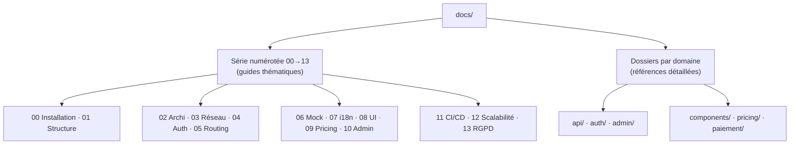

# Documentation Cyna-Web

Documentation technique du frontend **Cyna-Web** — la vitrine e-commerce SaaS de
cybersécurité (SPA React + Vite, découplée d'un backend .NET).

> 🚀 Nouveau sur le projet ? Commencez par
> [**00 Installation et démarrage**](./00%20installation%20et%20demarrage.md),
> puis [**02 Architecture**](./02%20architecture.md).

La doc est organisée en deux niveaux :

- **Guides thématiques** — la série numérotée `00`→`13`, à lire dans l'ordre pour
  comprendre le projet.
- **Références détaillées** — des dossiers par domaine (`api/`, `auth/`,
  `admin/`, `components/`, `pricing/`, `paiement/`) pour approfondir une feature.

---

## 🗺️ Plan

---

## 📘 Guides thématiques (00 → 13)

| # | Doc | Contenu |
|---|---|---|
| 00 | [Installation et démarrage](./00%20installation%20et%20demarrage.md) 🆕 | Prérequis, `.env`, modes mock/réel, dépannage |
| 01 | [Structure et conventions](./01%20Structure%20et%20conventions.md) | Arborescence, nommage, alias `@/`, règles |
| 02 | [Architecture](./02%20architecture.md) | Couches, flux de données, navigation, décisions |
| 03 | [Couche réseau](./03%20couche%20reseau.md) | `apiClient`, params, erreurs, interception mock |
| 04 | [Authentification](./04%20authentification.md) | Cookies httpOnly, rôles, 2FA, OTP |
| 05 | [Routing et gardes](./05%20routing%20et%20gardes.md) | Routes, `UserRoute`/`AdminRoute`…, `isAdminView` |
| 06 | [Mock et tests](./06%20mock%20et%20tests.md) | Registry, handlers, store, factories |
| 07 | [i18n](./07%20i18n.md) | 4 langues, namespaces, RTL |
| 08 | [Composants UI et thème](./08%20composants%20ui%20et%20theme.md) | shadcn/ui, Tailwind, thème |
| 09 | [Tarification et panier](./09%20tarification%20et%20panier.md) | Modèle à paliers, `findTier`, panier |
| 10 | [Admin back-office](./10%20admin%20backoffice.md) | Vue d'ensemble du back-office |
| 11 | [CI/CD et déploiement](./11%20cicd%20et%20deploiement.md) | Docker, nginx, fallback SPA, pipelines |
| 12 | [Scalabilité et performance](./12%20scalabilite%20et%20performance.md) 🆕 | Bundle, cache, virtualisation, équipe |
| 13 | [RGPD et données personnelles](./13%20rgpd%20et%20donnees%20personnelles.md) 🆕 | Données, cookies, droits, checklist |

🆕 = ajouté/refondu lors de la dernière revue de documentation.

---

## 📂 Références détaillées par domaine

### Couche données & mocks — `api/`
- [Référence des endpoints](./api/endpoints.md) ✏️ — table de toutes les routes API.
- [Faire un appel API](./api/Appels%20api.md) — utiliser `apiClient` et les modules `api/`.
- [Lier l'API et le mock](./api/Lier%20api%20et%20mock.md) — correspondance route ↔ handler, débogage.
- [Handlers mock](./api/Handlers.md) — simuler les routes.
- [Factories Faker](./api/Mock.md) — générer des données réalistes.
- [API Panier (localStorage)](./api/cart.md) — persistance du panier.

### Authentification — `auth/`
- [Connexion utilisateur](./auth/login-user.md)
- [Connexion admin (2FA)](./auth/login-admin.md)
- [Mot de passe oublié & confirmation d'email](./auth/forgot-password-confirm-email.md)

### Back-office — `admin/`
- [CRUD Produits](./admin/product-admin-crud.md) ✏️
- [CRUD Catégories](./admin/categories-admin.md)
- [Tableau de bord](./admin/dashboard.md)
- [Gestion des utilisateurs](./admin/users-admin.md)

### Pages & composants — `components/`
- [Page Produit](./components/product-page.md)
- [Page Panier](./components/cart-page.md)
- [Page Catalogue](./components/catalog-page.md)

### Tarification — `pricing/`
- [Vue d'ensemble](./pricing/overview.md)
- [Grille à paliers](./pricing/tiers.md)
- [Flux panier](./pricing/cart-flow.md)

### Paiement — `paiement/`
- [Checkout Stripe](./paiement/stripe-checkout.md)

✏️ = corrigé lors de la dernière revue.

---

## 🧭 Trouver l'info par besoin

| Je veux… | Voir |
|---|---|
| Lancer le projet en local | [00 Installation](./00%20installation%20et%20demarrage.md) |
| Comprendre l'organisation | [02 Architecture](./02%20architecture.md) + [01 Structure](./01%20Structure%20et%20conventions.md) |
| Ajouter une page / une route | [05 Routing](./05%20routing%20et%20gardes.md) + [Lier API et mock](./api/Lier%20api%20et%20mock.md) |
| Connaître une route API | [Endpoints](./api/endpoints.md) |
| Appeler le backend | [03 Couche réseau](./03%20couche%20reseau.md) |
| Développer sans backend | [06 Mock et tests](./06%20mock%20et%20tests.md) |
| Gérer l'auth / les rôles | [04 Authentification](./04%20authentification.md) |
| Ajouter une langue / traduction | [07 i18n](./07%20i18n.md) |
| Déployer (Docker, CI/CD, SPA) | [11 CI/CD et déploiement](./11%20cicd%20et%20deploiement.md) |
| Optimiser les perfs | [12 Scalabilité](./12%20scalabilite%20et%20performance.md) |
| Traiter une donnée personnelle | [13 RGPD](./13%20rgpd%20et%20donnees%20personnelles.md) |

---

## 🚧 Points d'attention (TODO)

- `/admin` (dashboard) — vérifier l'état du composant `AdminDashboard` vs la note « placeholder » de [05 Routing](./05%20routing%20et%20gardes.md).
- `POST /orders` — le body `items` utilise encore l'ancienne structure tarifaire.
- Handlers `/cart` (mock) — non utilisés : le panier passe par `localStorage`.
- Référence héritée `cyna_token` dans `cart-summary.jsx` (auth réelle = cookie ; voir [04 Authentification](./04%20authentification.md)).

---

## ✍️ Conventions de la documentation

- Les schémas utilisent **Mermaid** (rendu nativement par GitHub / la plupart des IDE) ou de l'ASCII art.
- Les chemins de fichiers pointent vers le code réel (`src/...`).
- Quand le code et la doc divergent, **le code fait foi** — signalez l'écart.
