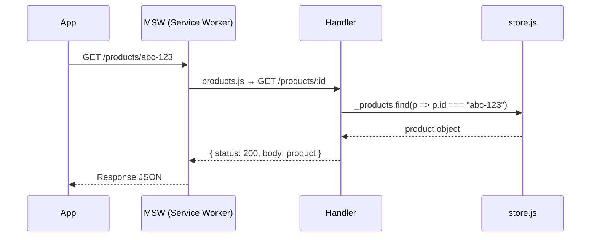

# Système de mock (MSW)

Le projet utilise **Mock Service Worker (MSW)** pour intercepter les requêtes HTTP en développement et retourner des données réalistes générées par Faker.

---

## Architecture du système

```
src/mocks/
├── index.js           Démarre MSW, enregistre tous les handlers
├── registry.js        Traduit les handlers custom → handlers MSW
├── store.js           Source unique : 40 produits + 6 catégories
├── factories/
│   └── factories.js   Fonctions makeUser, makeProduct, makeOrder, etc.
└── handlers/
    ├── auth.js        POST /auth/login, POST /auth/register
    ├── cart.js        GET/POST/PUT/DELETE /cart  (mock non utilisé, voir note)
    ├── home.js        GET /home/featured, GET /home/carousel
    ├── orders.js      Commandes, catalogue, catégories, carrousel, admin
    ├── orders-account.js  GET /account/orders
    ├── products.js    GET/POST/PUT/DELETE /products
    └── user.js        GET/PUT /user/profile
```

---

## store.js — Source unique de vérité

Avant cette architecture, chaque handler avait ses propres données mockées (IDs différents). Naviguer du catalogue vers la page produit échouait car les IDs ne correspondaient pas.

`src/mocks/store.js` résout ce problème :

```js
import { faker } from "@faker-js/faker"
import { makeMany, makeCategory, makeProduct } from "./factories/factories.js"

export const _categories = makeMany(6, makeCategory)
export const _products   = makeMany(40, () =>
  makeProduct({ categoryId: faker.helpers.arrayElement(_categories).id })
)
```

Tous les handlers importent depuis `store.js` :
```js
import { _products, _categories } from "../store.js"
```

> **Contrainte ES modules** : il est impossible de réassigner une exportation importée. Le handler DELETE utilise `.splice()` pour muter le tableau au lieu de réassigner.

---

## Factories

`src/mocks/factories/factories.js` exporte une factory par entité :

| Factory | Entité générée |
|---|---|
| `makeUser(overrides)` | Utilisateur |
| `makeCategory(overrides)` | Catégorie cybersécurité (SOC, EDR, XDR…) |
| `makeProduct(overrides)` | Produit SaaS avec `pricingPlans` complets |
| `makeOrder(overrides)` | Commande avec items |
| `makeOrderItem(overrides)` | Ligne de commande |
| `makeSubscription(overrides)` | Abonnement actif |
| `makeAddress(overrides)` | Adresse de facturation |
| `makePaymentMethod(overrides)` | Méthode de paiement (Stripe mock) |
| `makeCarouselItem(overrides)` | Slide du carrousel |
| `makeAuthResponse(overrides)` | Réponse login/register avec token |
| `makeMany(n, factory)` | Génère n éléments avec une factory |

### makeProduct — Combinaisons de plans

`makeProduct` génère aléatoirement l'une des 7 combinaisons de billing period :
```
[monthly]
[yearly]
[lifetime]
[monthly, yearly]
[monthly, lifetime]
[yearly, lifetime]
[monthly, yearly, lifetime]
```

---

## Flux d'une requête mockée



---

## Note sur le panier mock

Le handler `POST /cart` dans `handlers/orders.js` utilise encore **l'ancienne structure** (`productId`, `quantity`, `duration`). Il n'est **pas utilisé** par le frontend : le panier est géré en **localStorage** via `src/api/cart.js`.

> À mettre à jour pour aligner avec la nouvelle structure avant de brancher le vrai backend.
