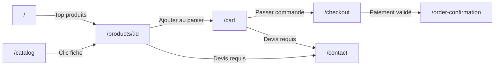

# Routing

Défini dans `src/App.jsx` avec React Router v6.

## Table des routes

| Chemin | Composant | Description |
|---|---|---|
| `/` | `Home` | Page d'accueil (carousel, top produits, catégories) |
| `/login` | `LoginPage` | Connexion |
| `/register` | `RegisterPage` | Inscription |
| `/catalog` | `Catalog` | Catalogue avec filtres et pagination |
| `/products/:id` | `Product` | Détail d'un produit + pricing |
| `/cart` | `Cart` | Panier |
| `/checkout` | `Checkout` | Tunnel de paiement |
| `/order-confirmation` | `OrderConfirmation` | Confirmation de commande |
| `/account/profile` | `Profile` | Profil utilisateur + abonnements |
| `/account/orders` | `OrderHistory` | Historique des commandes |
| `/contact` | `Contact` | Page de contact / demande de devis |
| `/cgu` | `CGU` | Conditions générales |
| `/mentions-legales` | `MentionsLegales` | Mentions légales |
| `/privacy` | `Privacy` | Politique de confidentialité |
| `/mock-demo` | `MockDemo` | Page de démonstration des mocks (dev only) |
| `/loading` | `Loading` | Écran de chargement |
| `/unauthorized` | `Unauthorized` | Accès non autorisé |
| `*` | `NotFound` | Page 404 |

---

## Flux de navigation pricing

---

## Lazy loading

Toutes les routes sont enveloppées dans `<Suspense fallback={<Loading />}>` pour permettre le code splitting futur.
