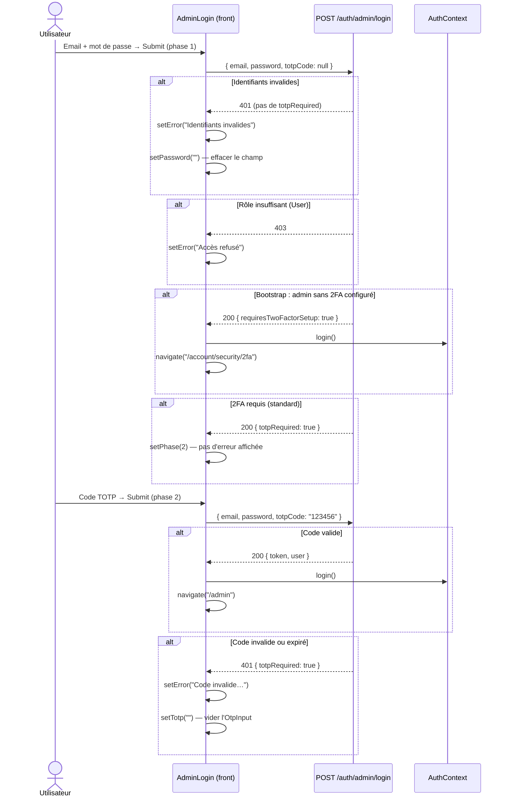

# Authentification — Connexion administrateur (2FA TOTP)

Page : `src/pages/auth/admin-login.jsx`  
Route : `/admin/login`

> **Cas spécial** — cette page implémente un flux à **deux phases** avec TOTP (Time-based One-Time Password) et gère le cas bootstrap (admin sans 2FA configuré).

---

## Pourquoi deux formulaires ?

La sécurité du backoffice exige une authentification à deux facteurs obligatoire. La connexion se déroule en deux temps :

1. **Phase 1** — email + mot de passe
2. **Phase 2** — code TOTP à 6 chiffres (application Authenticator)

Le backend pilote la transition : un seul endpoint (`POST /auth/admin/login`) gère les deux phases via des flags de réponse.

---

## Architecture du composant

```
AdminLogin
├── StepPill (1) ──── StepPill (2)      ← indicateur visuel des étapes
│
├── [phase === 1]
│   └── form → handleCredentials → submit(null)
│
└── [phase === 2]
    └── form → handleTotp → submit(totp)
        ├── Bloc hint "Ouvrez votre application"
        ├── OtpInput (6 cases)
        └── Bouton "Modifier mes identifiants" (retour phase 1)
```

### Composants utilisés

| Import | Rôle |
|--------|------|
| `AuthCard` | Carte centrée réutilisable (icon + title + subtitle + footer) |
| `OtpInput` | 6 cases pour le code TOTP |
| `StepPill` | Indicateur de progression (1 → 2) |
| `adminLogin()` | `src/api/auth.js` → `POST /auth/admin/login` |
| `useAuth().login()` | fetchMe après succès |
| `ShieldCheck`, `Smartphone` | Icônes Lucide |

---

## State

```js
const [email,    setEmail]    = useState("")
const [password, setPassword] = useState("")
const [showPwd,  setShowPwd]  = useState(false)   // toggle visibilité mdp
const [totp,     setTotp]     = useState("")       // code 6 chiffres
const [phase,    setPhase]    = useState(1)        // 1 | 2
const [loading,  setLoading]  = useState(false)
const [error,    setError]    = useState("")
```

---

## Flux complet



---

## Comportement détaillé de `submit(totpCode)`

```js
const submit = async (totpCode) => {
  setLoading(true)
  setError("")
  try {
    const data = await adminLogin({ email, password, totpCode })
    login()
    navigate(data?.requiresTwoFactorSetup ? "/account/security/2fa" : "/admin")
  } catch (err) {
    const body = err?.data ?? {}
    if (body.totpRequired) {
      // Transition silencieuse vers la phase 2 — pas une erreur
      setPhase(2)
    } else {
      setError(err.message ?? "Identifiants invalides.")
      setPassword("")   // ← effacer le mot de passe pour forcer une ressaisie
    }
  } finally {
    setLoading(false)
  }
}
```

> La distinction clé : si la réponse d'erreur contient `totpRequired: true`, c'est une transition d'étape attendue — on passe à la phase 2 **sans afficher d'erreur**. Sinon c'est un vrai échec.

---

## Visuel

### Phase 1 — Identifiants

```
┌──────────────────────────────────────┐
│        🛡️ (ShieldCheck violet)       │
│   Accès administrateur               │
│   Entrez vos identifiants            │
│                                      │
│   ① ─────── ②  ← StepPill           │
│   (gris)    (gris)                   │
│                                      │
│   Email ___________________________  │
│   Mot de passe ________________ 👁   │
│                                      │
│   [  Continuer  ]                    │
│                                      │
│   ← Retour à la connexion standard   │
└──────────────────────────────────────┘
```

### Phase 2 — TOTP

```
┌──────────────────────────────────────┐
│        🛡️ (ShieldCheck violet)       │
│   Accès administrateur               │
│   Entrez le code de votre appli      │
│                                      │
│   ① ─────── ②  ← StepPill           │
│   (violet)  (noir = actif)           │
│                                      │
│   📱 Ouvrez votre application        │
│      Authenticator pour              │
│      admin@cyna.fr                   │
│                                      │
│   Code à 6 chiffres                  │
│   [ _ ][ _ ][ _ ][ _ ][ _ ][ _ ]    │
│   Valide 30 secondes                 │
│                                      │
│   [  Vérifier  ]                     │
│                                      │
│   Modifier mes identifiants          │
│   ← Retour à la connexion standard   │
└──────────────────────────────────────┘
```

---

## StepPill — indicateur d'étape

```jsx
function StepPill({ step, active, done }) {
  // done  → fond violet #7C3AED
  // active → fond gris foncé #111
  // autre  → gris clair
}
```

Les deux pills sont affichées en permanence. Quand `phase` passe à 2 :
- Pill 1 : `done={true}` → violet
- Pill 2 : `active={true}` → gris foncé

---

## Cas bootstrap (admin sans 2FA)

Si l'administrateur n'a **jamais configuré** son 2FA (`hasTwoFactor: false` dans le store), le backend retourne directement un token avec `requiresTwoFactorSetup: true`. Le front :

1. Appelle `login()` (fetchMe)
2. Redirige vers `/account/security/2fa` immédiatement
3. Ne passe **jamais** à la phase 2

Cela évite qu'un admin nouvellement créé soit bloqué sans pouvoir configurer son 2FA.

---

## i18n

Namespace : `admin-login`

| Clé | Texte FR |
|-----|----------|
| `title` | Accès administrateur |
| `subtitlePhase1` | Entrez vos identifiants |
| `subtitlePhase2` | Entrez le code de votre application |
| `emailLabel` | Adresse e-mail |
| `emailPlaceholder` | admin@cyna.fr |
| `passwordLabel` | Mot de passe |
| `continue` | Continuer |
| `verifying` | Vérification… |
| `totpLabel` | Code à 6 chiffres |
| `totpHint` | Valide 30 secondes |
| `appHint.title` | Ouvrez votre application Authenticator |
| `appHint.description` | Entrez le code affiché pour {{email}} |
| `submit` | Vérifier |
| `editCredentials` | Modifier mes identifiants |
| `standardLoginLink` | Retour à la connexion standard |
| `otpDigit` | Chiffre {{n}} |

---

## Mock

Handler : `POST /auth/admin/login` dans `src/mocks/handlers/auth.js`

**Comptes disponibles :**

```
Email        : admin@cyna.fr   (ou tout user avec role Admin/SuperAdmin dans _adminUsers)
Mot de passe : password
Code TOTP    : 000000
```

**Scénarios mock :**

| Situation | Comportement |
|-----------|--------------|
| Mauvais mdp | 401, message "Identifiants invalides" |
| Utilisateur non-admin | 403, message "Accès refusé" |
| Admin sans 2FA (`hasTwoFactor: false`) | 200 + `requiresTwoFactorSetup: true` → redirect `/account/security/2fa` |
| Admin avec 2FA, pas de totpCode | 200 + `totpRequired: true` → phase 2 silencieuse |
| Code TOTP `000000` | 200 + token → redirect `/admin` |
| Autre code TOTP | 401, message "Code TOTP invalide ou expiré" |

---

## Fichiers concernés

```
src/pages/auth/admin-login.jsx          Page principale
src/api/auth.js                         adminLogin()
src/mocks/handlers/auth.js              Handler POST /auth/admin/login
src/components/auth/auth-card.jsx       AuthCard wrapper
src/components/auth/otp-input.jsx       OtpInput 6 cases
src/contexts/auth-context.jsx           AuthContext + fetchMe
src/hooks/use-auth.js                   useAuth() + isAdminView
```
