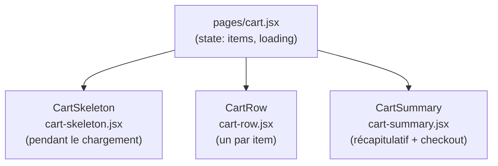

# Composants — Page Panier

`pages/cart.jsx` orchestre 3 composants dédiés dans `src/components/cart/`.

---

## Décomposition



---

## Layout

```
┌─────────────────────────────────────────┬──────────────────┐
│ Cyna EDR Pro                            │ Récapitulatif     │
│ [Mensuel]                               │                   │
│                                         │ Sous-total 1 074€ │
│   Utilisateurs  − 3 +   199,00€/u      │ TVA (20%) 214€   │
│   Appareils    − 20 +    23,88€/app    │ ──────────────    │
│                           1 074,60 €   │ Total   1 289€    │
│ [Supprimer]                             │                   │
├─────────────────────────────────────────│ [PASSER COMMANDE] │
│ Sentinel XDR Suite                      └──────────────────┘
│ ...
```

---

## `CartRow`

Affiche un item du panier avec contrôles de quantité.

### Props

| Prop | Type | Rôle |
|---|---|---|
| `item` | `CartItem` | Item du panier |
| `onUsersChange` | `(id, qty) => void` | Callback changement users |
| `onDevicesChange` | `(id, qty) => void` | Callback changement appareils |
| `onRemove` | `(id) => void` | Callback suppression |

### Comportement

- Affiche toujours les lignes Utilisateurs **et** Appareils si les `pricingTiers` le prévoient (même à 0)
- Affiche le total ligne (`lineTotal`) en dessous des deux prix unitaires
- Si devis requis → remplace le total par `"Sur devis"` en orange

### `lineTotal` (helper exporté)

```js
export function lineTotal(item) {
  return (item.unitPriceUsers * item.quantityUsers)
       + (item.unitPriceDevices * item.quantityDevices)
}
```

---

## `CartSummary`

Affiche le récapitulatif des prix et le bouton checkout.

### Props

| Prop | Type | Rôle |
|---|---|---|
| `subtotal` | `number` | Somme des `lineTotal` de tous les items |
| `tva` | `number` | TVA à 20% |
| `total` | `number` | `subtotal + tva` |
| `hasItems` | `boolean` | Désactive le bouton si panier vide |
| `hasQuoteItem` | `boolean` | Désactive checkout + affiche message devis |
| `onCheckout` | `() => void` | Navigue vers `/checkout` |

### Règle devis

Si un seul item dépasse `maxUsersCheckout` ou `maxDevicesCheckout` :
- Message orange : "Un ou plusieurs articles nécessitent un devis"
- Bouton checkout **désactivé**

---

## `CartSkeleton`

Affiche un skeleton shadcn pendant le chargement initial du panier depuis localStorage.  
Reproduit la structure de 2 `CartRow` + 1 `CartSummary`.

---

## Recalcul des prix en panier

Quand l'utilisateur modifie une quantité, `pages/cart.jsx` recalcule le prix unitaire via `findTier` :

```js
const handleUsersChange = async (id, quantity) => {
  const item    = items.find(i => i.id === id)
  const newTier = findTier(item.pricingTiers, UnitType.USER, quantity)
  const update  = {
    quantityUsers:  quantity,
    unitPriceUsers: newTier?.unitPrice ?? item.unitPriceUsers
  }
  await updateCartItem(id, update)
  setItems(prev => prev.map(i => i.id === id ? { ...i, ...update } : i))
}
```

> `pricingTiers` a été stocké dans l'item au moment de l'ajout — pas besoin de rappeler l'API.
