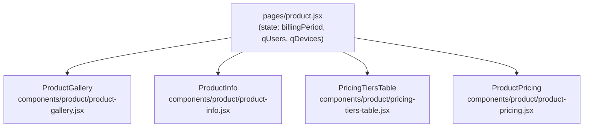

# Composants — Page Produit

La page produit est découpée en 4 composants distincts. `pages/product.jsx` est l'orchestrateur léger qui détient le state et délègue l'affichage.

---

## Décomposition



---

## Layout

```
┌─────────────────────────────────────────────┐
│  ProductGallery (md:w-1/2)  │ ProductInfo   │
│  Images carousel             │ Badge, titre  │
│                              │ Specs         │
│                              │ [Mensuel][Annuel][À vie]  │
├─────────────────────────────────────────────┤
│            PricingTiersTable (full width)    │
│  ┌──────────────┬────────────────────────┐  │
│  │ Utilisateurs │ Appareils              │  │
│  │ 1–5   199€   │ 1–50   23€             │  │
│  │ 6–10  149€ ← │ 51–100 17€             │  │
│  └──────────────┴────────────────────────┘  │
├─────────────────────────────────────────────┤
│            ProductPricing (full width)      │
│  [Utilisateurs −  3  +]  [Appareils −  20  +] │
│  1 074,60 € / mois                         │
│  [S'ABONNER MAINTENANT]  [Essayer 14j]     │
└─────────────────────────────────────────────┘
```

---

## State dans `pages/product.jsx`

| State | Type | Rôle |
|---|---|---|
| `billingPeriod` | `string\|null` | Plan actif (`"monthly"`, `"yearly"`, `"lifetime"`) |
| `quantityUsers` | `number` | Quantité utilisateurs (défaut: 1) |
| `quantityDevices` | `number` | Quantité appareils (défaut: 0) |

### Valeurs dérivées (calculées à chaque render)

| Variable | Calcul |
|---|---|
| `currentPlan` | `pricingPlans.find(p => p.billingPeriod === billingPeriod)` |
| `tierUser` | `findTier(currentPlan.pricingTiers, "user", quantityUsers)` |
| `tierDevice` | `findTier(currentPlan.pricingTiers, "device", quantityDevices)` |
| `totalPrice` | `(tierUser.unitPrice × qUsers) + (tierDevice.unitPrice × qDevices)` |
| `isQuoteRequired` | `qUsers > maxUsersCheckout \|\| qDevices > maxDevicesCheckout` |

---

## Composants détaillés

### `ProductInfo`
- Affiche : badge disponibilité, titre, description, specs techniques
- Affiche les boutons de sélection de billing period dans l'ordre canonique : `monthly → yearly → lifetime`
- Props : `product`, `billingPeriod`, `onBillingPeriodChange`

### `PricingTiersTable`
- Affiche la grille de tarification sous forme de tableau shadcn
- Colonne gauche : Utilisateurs / Colonne droite : Appareils (si les deux existent)
- Surligne la tranche active (fond `primary/5`, texte `primary`)
- Props : `tiers`, `activeTierUser`, `activeTierDevice`

### `ProductPricing`
- Compteurs `+/-` pour users et devices
- Affiche le prix total ou le message "devis" si hors limite
- Bouton "S'abonner" → appelle `addToCart` puis navigue vers `/cart`
- Bouton "Devis" → navigue vers `/contact`
- Props : `currentPlan`, `billingPeriod`, `quantityUsers`, `quantityDevices`, `onUsersChange`, `onDevicesChange`, `tierUser`, `tierDevice`, `totalPrice`, `isQuoteRequired`, `productName`, `isAvailable`

---

## Initialisation du billingPeriod

```js
useEffect(() => {
  // Après chargement du produit, on prend le premier plan disponible
  setBillingPeriod(productData?.pricingPlans?.[0]?.billingPeriod ?? null)
}, [id])
```

> On n'initialise pas à `"monthly"` car un produit peut ne pas avoir de plan mensuel.
