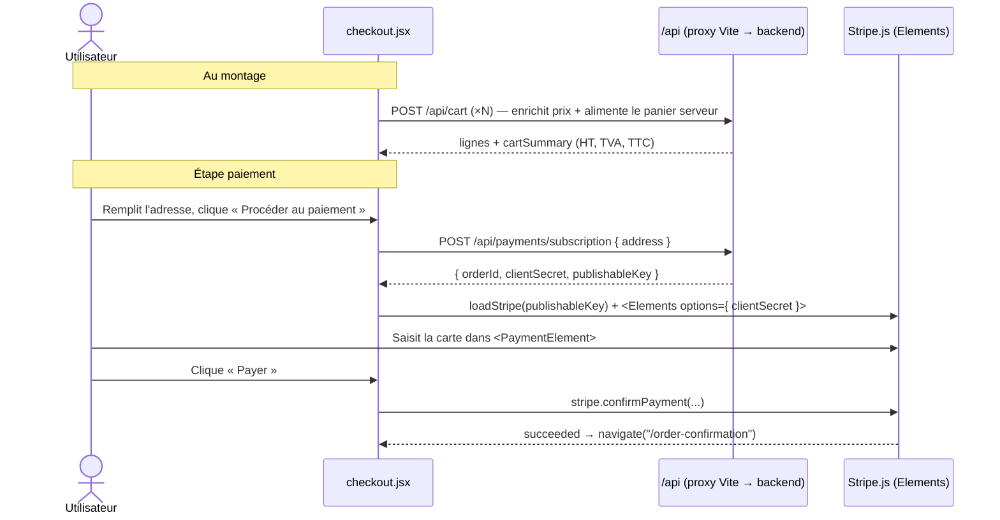
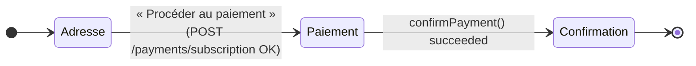
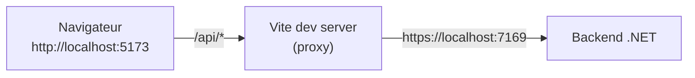

# Paiement Stripe — Checkout (Front)

Intégration de **Stripe Elements** sur la page de paiement, branchée sur l'API réelle via le proxy Vite.

> Le front ne manipule **jamais** le numéro de carte : il est saisi dans le composant sécurisé
> `<PaymentElement>` hébergé par Stripe. Le front ne voit qu'un `clientSecret` opaque.

---

## Vue d'ensemble



---

## Le composant `checkout.jsx`

| Sous-composant | Rôle |
|---|---|
| `Checkout` | Page principale : panier, adresse, orchestration |
| `StripePaymentForm` | Rendu **dans** `<Elements>` (accès aux hooks `useStripe`/`useElements`) ; contient `<PaymentElement>` + bouton « Payer » |
| `CheckoutSummary` | Récapitulatif HT / TVA / TTC + bouton « Procéder au paiement » |
| `StepBlock` | Bloc visuel d'étape (compte / adresse / paiement) |

### Machine à 2 temps

L'`<PaymentElement>` a besoin d'un `clientSecret`, qui n'existe qu'après création de la commande.
La page bascule donc entre deux états selon `payment` (`null` → `{ clientSecret, publishableKey, orderId }`) :



---

## Code clé

### Initialisation du paiement

`src/pages/checkout.jsx`

```jsx
const handleProceed = async () => {
  // validation adresse…
  const res = await apiClient.post("/payments/subscription", { address })
  setPayment({
    clientSecret:   res.clientSecret,
    publishableKey: res.publishableKey,
    orderId:        res.orderId,
  })
}

// Promesse Stripe créée une fois la clé publiable reçue
const stripePromise = useMemo(
  () => (payment?.publishableKey ? loadStripe(payment.publishableKey) : null),
  [payment?.publishableKey]
)
```

### Confirmation du paiement

```jsx
function StripePaymentForm({ total, onSuccess }) {
  const stripe = useStripe()
  const elements = useElements()

  const handlePay = async () => {
    const { error, paymentIntent } = await stripe.confirmPayment({
      elements,
      redirect: "if_required",
      confirmParams: { return_url: `${window.location.origin}/order-confirmation` },
    })
    if (error) return toast.error(error.message)
    if (paymentIntent?.status === "succeeded") onSuccess()
  }

  return (<><PaymentElement /><Button onClick={handlePay}>Payer</Button></>)
}
```

> `redirect: "if_required"` : les cartes sans 3DS sont confirmées **sans redirection**. Une carte
> 3DS redirige vers `return_url` (`/order-confirmation`).

### Après succès

```jsx
const handleSuccess = async () => {
  await clearCart()                               // vide le panier localStorage
  navigate("/order-confirmation", { state: { total } })
}
```

> Côté serveur, c'est le **webhook** qui passe la commande en `Paid` et vide le panier backend —
> pas le front.

---

## 🔌 Câblage API : le proxy Vite (important)

Le front passe par le **proxy Vite** pour parler au backend. C'est ce qui évite les problèmes de
CORS et de cookies cross-origin.



`vite.config.ts` :
```ts
server: {
  proxy: {
    "/api": {
      target: "https://localhost:7169",
      changeOrigin: true,
      secure: false,                              // ignore le certif HTTPS auto-signé .NET
      rewrite: (path) => path.replace(/^\/api/, ""),
    },
  },
}
```

`.env` :
```
VITE_API_URL=/api      # ← passe par le proxy (même origine). NE PAS mettre https://localhost:7169
VITE_MOCK_API=false
```

### Pourquoi `/api` et pas l'URL directe du backend ?

| Approche | Problème |
|---|---|
| `VITE_API_URL=https://localhost:7169` | Cross-origin **et cross-scheme** (http→https). Le cookie d'auth `SameSite=Strict` n'est **pas envoyé** par le navigateur (*schemeful same-site*) → « non connecté » → paiement impossible. |
| `VITE_API_URL=/api` ✅ | Le navigateur ne parle qu'à `localhost:5173` (même origine). Cookies, CORS et scheme : aucun souci. Seul le proxy Node parle au backend en HTTPS. |

> L'authentification repose sur un cookie **HttpOnly** `cyna_token` (illisible en JS). L'état
> connecté est géré par `AuthContext` via `GET /api/auth/me`. Avec le proxy, ce cookie circule
> correctement.

---

## ▶️ Lancer en local

```bash
# 1. Backend (https, doit matcher la cible du proxy)
dotnet run --project Api --launch-profile https

# 2. Webhook (pour que la commande passe Paid)
stripe listen --forward-to https://localhost:7169/payments/webhook

# 3. Front
npm run dev            # http://localhost:5173
```

Puis : se connecter → ajouter un produit au panier → `/checkout` → adresse → **Procéder au
paiement** → carte test `4242 4242 4242 4242`, `12/34`, `123` → **Payer**.

> Sans `stripe listen`, le paiement réussit quand même côté Stripe, mais la commande reste
> `Pending` en base (c'est le webhook qui la confirme).

---

## ⚠️ Limites connues

* Le front confirme **un seul** `clientSecret` (panier homogène). Un panier mélangeant
  mensuel + annuel + à vie génère plusieurs paiements → évolution future.
* Le 3DS complet (redirection puis retour) finalise sur `/order-confirmation` ; le statut final de
  la commande reste porté par le webhook.
