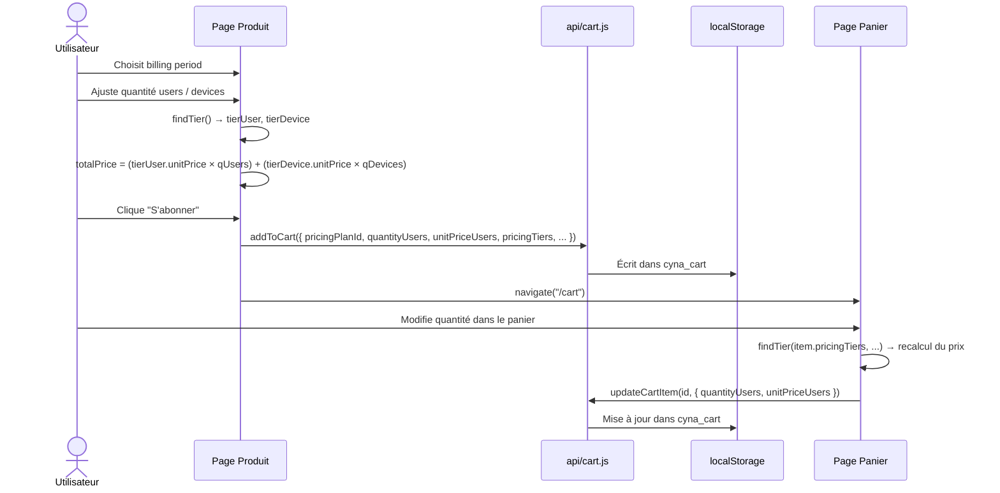

# Flux panier — de la sélection au checkout

## Vue d'ensemble



---

## Structure d'un item dans le panier (localStorage)

```json
{
  "id": "cart-item-uuid",
  "pricingPlanId": "plan-uuid",
  "productName": "Cyna EDR Pro",
  "billingPeriod": "monthly",
  "quantityUsers": 3,
  "quantityDevices": 20,
  "unitPriceUsers": 199.00,
  "unitPriceDevices": 23.88,
  "pricingTiers": [...],
  "maxUsersCheckout": 10,
  "maxDevicesCheckout": 100
}
```

### Pourquoi stocker `pricingTiers` et `unitPrice` ?

| Champ | Raison |
|---|---|
| `unitPriceUsers` / `unitPriceDevices` | **Snapshot** — prix verrouillé au moment de l'ajout |
| `pricingTiers` | Permet de **recalculer** en panier si la quantité change sans rappeler l'API |
| `maxUsersCheckout` / `maxDevicesCheckout` | Permet d'afficher le badge "Devis requis" dans le panier sans rappeler l'API |

---

## Calcul du total ligne (`lineTotal`)

`src/components/cart/cart-row.jsx`

```js
export function lineTotal(item) {
  return (item.unitPriceUsers * item.quantityUsers)
       + (item.unitPriceDevices * item.quantityDevices)
}
```

---

## Recalcul en panier lors du changement de quantité

`src/pages/cart.jsx`

```js
const handleUsersChange = async (id, quantity) => {
  const item    = items.find(i => i.id === id)
  const newTier = findTier(item.pricingTiers, UnitType.USER, quantity)
  const update  = {
    quantityUsers: quantity,
    unitPriceUsers: newTier?.unitPrice ?? item.unitPriceUsers
  }
  await updateCartItem(id, update)
  setItems(prev => prev.map(i => i.id === id ? { ...i, ...update } : i))
}
```

> Si `findTier` retourne `null` (quantité hors tranche), le prix snapshot précédent est conservé et le badge "Devis requis" s'affiche.

---

## Règle de déduplication

Si un `pricingPlanId` identique est ajouté deux fois, `addToCart` **remplace** les quantités au lieu de créer un doublon :

```js
const existing = cart.find(i => i.pricingPlanId === item.pricingPlanId)
if (existing) {
  existing.quantityUsers    = item.quantityUsers
  existing.unitPriceUsers   = item.unitPriceUsers
  // ...
}
```
