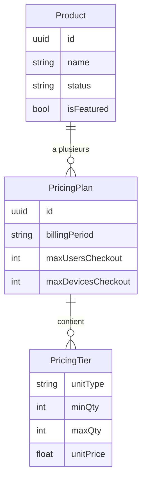

# Modèle de tarification — Vue d'ensemble

Cyna utilise un modèle **hybride à paliers (volume-based)** : le prix unitaire diminue lorsque la quantité augmente. Chaque produit peut être vendu selon plusieurs périodes de facturation.

---

## Enums

### BillingPeriod
Défini dans `src/lib/pricing.js`.

| Valeur | Constante | Signification |
|---|---|---|
| `"monthly"` | `BillingPeriod.MONTHLY` | Facturation mensuelle |
| `"yearly"` | `BillingPeriod.YEARLY` | Facturation annuelle |
| `"lifetime"` | `BillingPeriod.LIFETIME` | Paiement unique à vie |

### UnitType
| Valeur | Constante | Signification |
|---|---|---|
| `"user"` | `UnitType.USER` | Licence par utilisateur |
| `"device"` | `UnitType.DEVICE` | Licence par appareil |

---

## Structure de données d'un produit

```
Product
├── id                  string (UUID)
├── name                string
├── description         string
├── status              "available" | "unavailable" | "out_of_stock"
├── categoryId          string (UUID)
├── isFeatured          boolean
├── images              string[]
├── technicalSpecs      string[]
└── pricingPlans        PricingPlan[]
```

```
PricingPlan
├── id                  string (UUID)
├── name                string         ex. "Mensuel"
├── billingPeriod       BillingPeriod  "monthly" | "yearly" | "lifetime"
├── discountPercent     number
├── maxUsersCheckout    number         seuil au-delà duquel → devis
├── maxDevicesCheckout  number         seuil au-delà duquel → devis
└── pricingTiers        PricingTier[]
```

```
PricingTier
├── unitType            UnitType       "user" | "device"
├── minQty              number
├── maxQty              number
└── unitPrice           number         prix par unité dans cette tranche
```

---

## Schéma relationnel



---

## Exemple JSON complet

```json
{
  "id": "prod-uuid",
  "name": "Cyna EDR Pro",
  "status": "available",
  "pricingPlans": [
    {
      "id": "plan-monthly-uuid",
      "billingPeriod": "monthly",
      "maxUsersCheckout": 10,
      "maxDevicesCheckout": 100,
      "pricingTiers": [
        { "unitType": "user",   "minQty": 1,  "maxQty": 5,   "unitPrice": 199.00 },
        { "unitType": "user",   "minQty": 6,  "maxQty": 10,  "unitPrice": 149.25 },
        { "unitType": "device", "minQty": 1,  "maxQty": 50,  "unitPrice": 23.88 },
        { "unitType": "device", "minQty": 51, "maxQty": 100, "unitPrice": 17.91 }
      ]
    },
    {
      "id": "plan-yearly-uuid",
      "billingPeriod": "yearly",
      "maxUsersCheckout": 10,
      "maxDevicesCheckout": 100,
      "pricingTiers": [
        { "unitType": "user",   "minQty": 1,  "maxQty": 5,   "unitPrice": 169.15 },
        { "unitType": "user",   "minQty": 6,  "maxQty": 10,  "unitPrice": 126.86 }
      ]
    }
  ]
}
```

> Un produit peut avoir seulement `monthly`, seulement `yearly`, seulement `lifetime`, ou n'importe quelle combinaison des trois.
