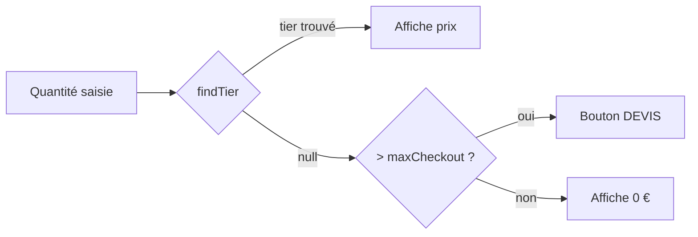

# Grille de tarification à paliers

## Principe

Le prix unitaire **baisse** quand la quantité augmente. Chaque `PricingTier` couvre une tranche `[minQty, maxQty]`.  
Si la quantité sort de toutes les tranches → le checkout est bloqué et un devis est proposé.

---

## Fonction `findTier`

`src/lib/pricing-utils.js`

```js
export function findTier(tiers, unitType, quantity) {
  if (!tiers || quantity <= 0) return null
  return tiers.find(
    t => t.unitType === unitType && quantity >= t.minQty && quantity <= t.maxQty
  ) ?? null
}
```

| Paramètre | Type | Rôle |
|---|---|---|
| `tiers` | `PricingTier[]` | Tous les tiers du plan actif |
| `unitType` | `UnitType` | `"user"` ou `"device"` |
| `quantity` | `number` | Quantité saisie par l'utilisateur |
| **Retour** | `PricingTier \| null` | Tranche active, ou `null` |

> `null` signifie soit quantité = 0, soit quantité > maxQty du dernier tier → **devis requis**.

---

## Exemple de grille (plan mensuel)

| Type | De | À | Prix/unité |
|---|---|---|---|
| Utilisateur | 1 | 5 | 199,00 € |
| Utilisateur | 6 | 10 | 149,25 € |
| Appareil | 1 | 50 | 23,88 € |
| Appareil | 51 | 100 | 17,91 € |

**Calcul du total :**
```
totalPrice = (unitPriceUsers × quantityUsers) + (unitPriceDevices × quantityDevices)
```

Exemple : 3 utilisateurs + 20 appareils
```
= (199.00 × 3) + (23.88 × 20)
= 597.00 + 477.60
= 1 074,60 €/mois
```

---

## Logique de devis (`isQuoteRequired`)

Calculé dans `src/pages/product.jsx` :

```js
const isQuoteRequired = currentPlan && (
  (hasUserTiers   && quantityUsers   > currentPlan.maxUsersCheckout)   ||
  (hasDeviceTiers && quantityDevices > currentPlan.maxDevicesCheckout)
)
```



---

## Séparation frontend / backend

| Responsabilité | Frontend | Backend |
|---|---|---|
| Calcul d'affichage (prix live) | `findTier` dans `pricing-utils.js` | — |
| Validation finale de la commande | — | Recalcul indépendant |
| ID tier envoyé au backend | Non (non nécessaire) | — |
| Prix snapshot dans le panier | Stocké à l'ajout | Revalidé au checkout |

> Le frontend **ne renvoie pas** d'ID de tier au backend. Le backend recalcule seul à partir des quantités + plan ID.
